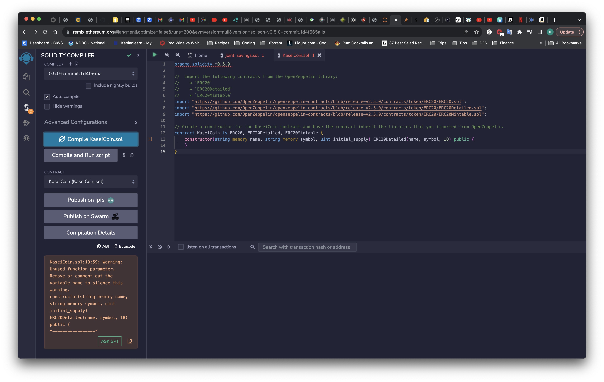
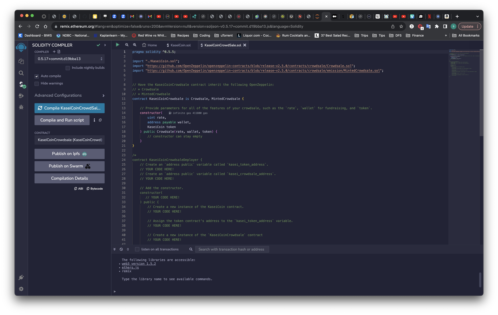
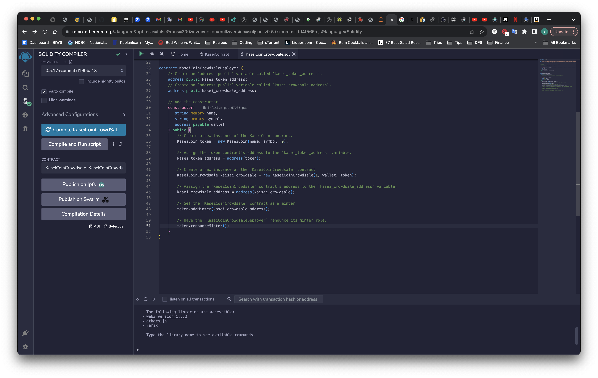
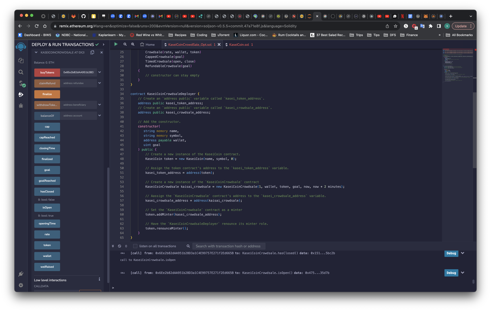

# Project-KaseiCoin
Conversion app from various currencies to a fungible token that’s ERC-20 compliant

## Evaluation Evidence

### Create the KaseiCoin Token Contract

### Create the KaseiCoin Crowdsale Contract
(had to change the compiler to 0.5.17 to work with the imports)

### Create the KaseiCoin Deployer Contract

### Deploy and Test the Crowdsale on a Local Blockchain
(we did not cover MetaMask, so the video doesn't include it. Also, the poor quality is due to the large compression required to keep the size small) 
[Deployment Video](Evidence/kaseicoin_deployment.mov)

### Optional: Extend the Crowdsale Contract by Using OpenZeppelin
(we did not cover MetaMask, so this is a snapshot of the resulting ABI)

